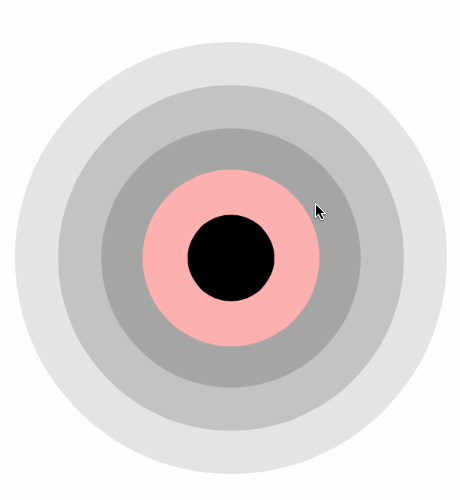

# circles

A tappable view showing gradually changing tint circles with a central "planet", with a breathe-like animation.

A small experimental `Swift 1.2` project to play with `@IBDesignable` and `@IBInspectable`.

Made for a possible use in an upcoming project. 

### Features
- No usage of `drawRect` etc, layers only = performance
- Could be initialized either from a storyboard or from a code
- `IBDesignable` for WYSIWYG use in storyboards, you can adjust:
  - number of orbits
  - farthest orbit color, other orbits colors will be calculated gradually and automatically
  - adjacent orbit color darken by value (0.0-1.0)
  - central planet color
  - central planet size percentage related to the whole view
  - initially selected orbit, generally and number starting from the planet
  - selected orbit color
  - tap gesture recognizer enable/disable
  - active orbit animation duration and bias in points (not percents, because of different orbit radiuses, looked weird)

#### Delegate
- When orbit is selected:
`func circlesSelectedOrbit(circles: Circles, selectedOrbitNumber: UInt)`

### Installation
Just copy `Circles.swift` and `CirclesExtensions.swift` to your project.

### Contact
Roman Shevtsov
https://twitter.com/ryushev

### License
MIT
